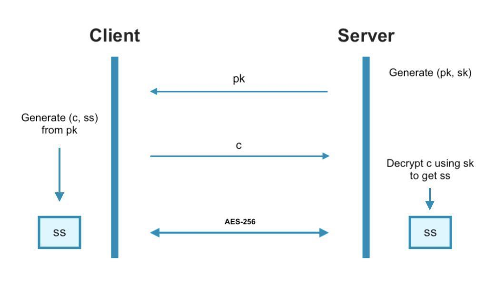

# CRYSTALS-KYBER JavaScript

**CRYSTALS-KYBER** is a post-quantum key exchange protocol.

This protocol is used to securely establish symmetric keys between two parties. 

This JavaScript implementation is intended for client-side web browser applications but of course can be used for any JavaScript based application.

Most of this code was translated from [Nadim Kobeissi](https://nadim.computer)'s Go implementation of Kyber which can be found [here](https://github.com/symbolicsoft/kyber-k2so).

Code by the original designers (written in C) can be found [here](https://github.com/pq-crystals/kyber).

Kyber's original design comes in 512, 768, 1024 security strengths. This implementation only supports the security strength of 768 at the moment. In the future these strengths will be implemented as well as any updates if changes are made to the original design.

This code is the most up to date version based off the [NIST PQC Round 3 Submissions](https://csrc.nist.gov/projects/post-quantum-cryptography/round-3-submissions).

## Functionality

**KYBER-768** will securely distribute a 256 bit symmetric key between two parties. To safely transmit data over a channel using the key, AES-256 is recommended.

The exchange can be visualised below:



## Usage
Using Node.js or React:
```bash
npm install crystals-kyber
```
Import the functions at the top of your js file.
```js
import {K768_KeyGen, K768_Encrypt, K768_Decrypt} from 'crystals-kyber';
```
To use in your code:
```js
// To generate a public and private key pair (pk, sk)
var pk_sk = K768_KeyGen();
var pk = pk_sk[0];
var sk = pk_sk[1];

// To generate a random 256 bit symmetric key (ss) and its encapsulation (c)
var c_ss = K768_Encrypt(pk);
var c = c_ss[0];
var ss1 = c_ss[1];

// To decapsulate and obtain the same symmetric key
var ss2 = K768_Decrypt(c,sk);
```
Test output:
```bash
ss1 [
   97,  32, 209, 176, 112, 188, 129,
  160, 229,  52,  55,  64, 109,  33,
  115, 178,  32, 216, 149, 143, 116,
   45, 205, 242,  18,  30, 115, 177,
  233, 141, 245, 137
]
ss2 [
   97,  32, 209, 176, 112, 188, 129,
  160, 229,  52,  55,  64, 109,  33,
  115, 178,  32, 216, 149, 143, 116,
   45, 205, 242,  18,  30, 115, 177,
  233, 141, 245, 137
]
1
```
## Running Tests
Output from function TestK768() that tests compatibility with the original C implementation based on run cases in `PQCkemKAT_2400.rsp`.
```bash
Test run [ 0 ] success
Test run [ 1 ] success
Test run [ 2 ] success
Test run [ 3 ] success
Test run [ 4 ] success
Test run [ 5 ] success
Test run [ 6 ] success
Test run [ 7 ] success
Test run [ 8 ] success
Test run [ 9 ] success
Test run [ 10 ] success
Test run [ 11 ] success
Test run [ 12 ] success
Test run [ 13 ] success
Test run [ 14 ] success
Test run [ 15 ] success
Test run [ 16 ] success
Test run [ 17 ] success
Test run [ 18 ] success
Test run [ 19 ] success
Test run [ 20 ] success
Test run [ 21 ] success
Test run [ 22 ] success
Test run [ 23 ] success
Test run [ 24 ] success
Test run [ 25 ] success
Test run [ 26 ] success
Test run [ 27 ] success
Test run [ 28 ] success
Test run [ 29 ] success
Test run [ 30 ] success
Test run [ 31 ] success
Test run [ 32 ] success
Test run [ 33 ] success
Test run [ 34 ] success
Test run [ 35 ] success
Test run [ 36 ] success
Test run [ 37 ] success
Test run [ 38 ] success
Test run [ 39 ] success
Test run [ 40 ] success
Test run [ 41 ] success
Test run [ 42 ] success
Test run [ 43 ] success
Test run [ 44 ] success
Test run [ 45 ] success
Test run [ 46 ] success
Test run [ 47 ] success
Test run [ 48 ] success
Test run [ 49 ] success
Test run [ 50 ] success
Test run [ 51 ] success
Test run [ 52 ] success
Test run [ 53 ] success
Test run [ 54 ] success
Test run [ 55 ] success
Test run [ 56 ] success
Test run [ 57 ] success
Test run [ 58 ] success
Test run [ 59 ] success
Test run [ 60 ] success
Test run [ 61 ] success
Test run [ 62 ] success
Test run [ 63 ] success
Test run [ 64 ] success
Test run [ 65 ] success
Test run [ 66 ] success
Test run [ 67 ] success
Test run [ 68 ] success
Test run [ 69 ] success
Test run [ 70 ] success
Test run [ 71 ] success
Test run [ 72 ] success
Test run [ 73 ] success
Test run [ 74 ] success
Test run [ 75 ] success
Test run [ 76 ] success
Test run [ 77 ] success
Test run [ 78 ] success
Test run [ 79 ] success
Test run [ 80 ] success
Test run [ 81 ] success
Test run [ 82 ] success
Test run [ 83 ] success
Test run [ 84 ] success
Test run [ 85 ] success
Test run [ 86 ] success
Test run [ 87 ] success
Test run [ 88 ] success
Test run [ 89 ] success
Test run [ 90 ] success
Test run [ 91 ] success
Test run [ 92 ] success
Test run [ 93 ] success
Test run [ 94 ] success
Test run [ 95 ] success
Test run [ 96 ] success
Test run [ 97 ] success
Test run [ 98 ] success
Test run [ 99 ] success
```

## Disclaimer
All effort has been made to ensure this code is functional and operating as intended according to the original CRYSTALS-KYBER design. Any issues or concerns can be sent to amt597@uowmail.edu.au.
